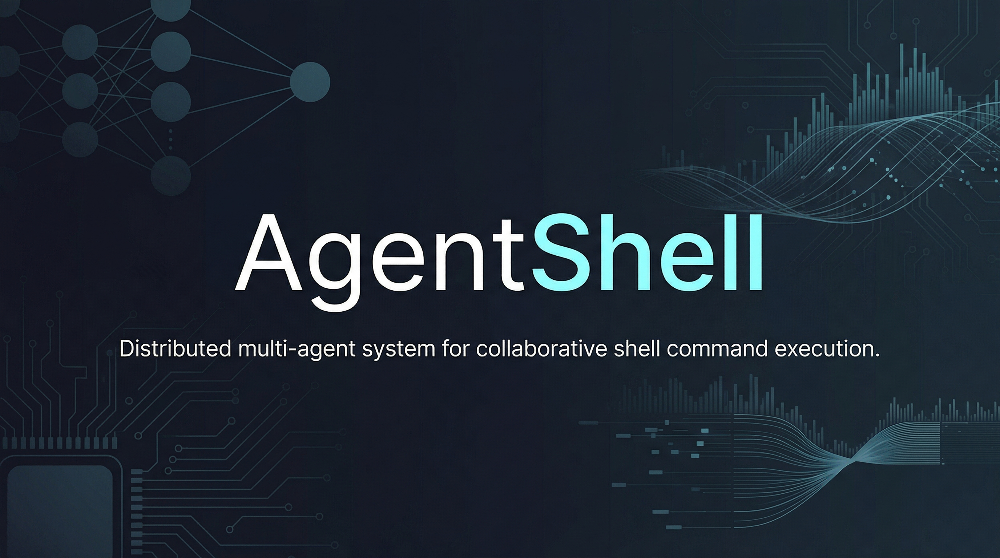
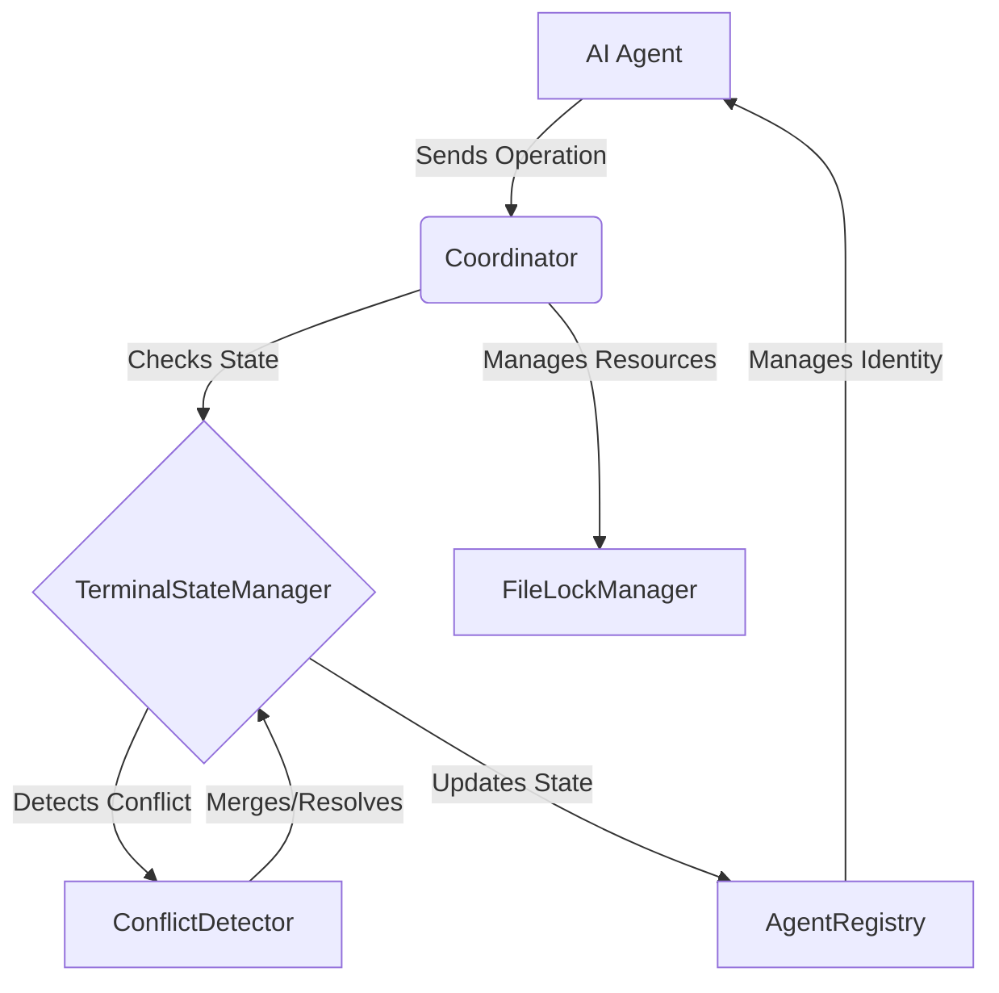

<p align="center">
  
</p>

<h1 align="center">AgentShell</h1>

<p align="center">
  <strong>Distributed multi-agent system for collaborative shell command execution.</strong>
</p>

<p align="center">
  <a href="https://github.com/Lumi-node/agent-shell-coordination"></a>
  <a href="https://github.com/Lumi-node/agent-shell-coordination"></a>
  <a href="https://github.com/Lumi-node/agent-shell-coordination"></a>
</p>

---

AgentShell is a research-oriented distributed multi-agent system designed to enable autonomous AI agents to collaborate on executing shell commands within shared computational environments. It tackles the complex problem of maintaining a consistent, causally-ordered view of a terminal session across multiple concurrent agents.

The core innovation lies in implementing the **TerminalStateManager** module, which utilizes vector clocks and operational transformation (specifically the Jupiter protocol) to ensure that terminal buffer states remain causally consistent even when agents operate concurrently and asynchronously.

---

## Quick Start

```bash
pip install agent_shell_coordination
```

```python
from mat import AgentCoordinator, AgentRegistry

# Create a coordinator for your agent
coordinator = AgentCoordinator(agent_id="agent_alpha")

# Register with the system
registry = AgentRegistry()
registry.register("agent_alpha", session_token="token123")

# List active agents
active_agents = registry.list_active()
print(f"Active agents: {active_agents}")

# Execute a command (when fully implemented)
# result = coordinator.execute("ls -la", timeout_seconds=30)
# print(f"Exit code: {result.exit_code}, Output: {result.stdout}")
```

## What Can You Do?

### Conflict-Free State Management
The system uses vector clocks and Lamport timestamps to order terminal operations, ensuring that concurrent modifications from different agents are merged deterministically without data loss or logical inconsistency.

```python
from mat.coordination.conflict_detector import ConflictDetector

detector = ConflictDetector()
# Simulate two concurrent operations (op1 and op2)
op1 = {"type": "write", "data": "hello"}
op2 = {"type": "write", "data": "world"}

merged_op = detector.merge_operations(op1, op2)
print(f"Merged Operation: {merged_op}")
```

### Agent Coordination and Registration
The `AgentRegistry` manages the lifecycle and state of all participating AI agents, providing a central point for coordination logic to interact with the distributed agents.

```python
from mat.core.agent_registry import AgentRegistry

registry = AgentRegistry()
registry.register_agent("agent_beta")
print(f"Current registered agents: {registry.get_agents()}")
```

## Architecture

AgentShell is structured around several interconnected modules that manage state, coordination, and conflict resolution.

The **`AgentRegistry`** acts as the central directory for all active agents. The **`Coordinator`** orchestrates the workflow, dispatching tasks and managing the overall state flow. The **`TerminalStateManager`** (implicitly managed via `mat.coordination`) is the heart of the system, using **`ConflictDetector`** to resolve concurrent operations. The **`FileLockManager`** ensures atomic access to shared resources outside the terminal buffer itself.



## API Reference

### `mat.AgentCoordinator`
High-level API for autonomous agents to coordinate commands.
- `__init__(agent_id: str, heartbeat_interval_seconds: int = 10)`: Create coordinator for an agent
- `execute(command: str, timeout_seconds: int = 60) -> ExecutionResult`: Execute a command with automatic lock management
- `set_env(var_name: str, value: str) -> None`: Set a shared environment variable
- `get_env(var_name: str) -> str`: Get a shared environment variable
- `list_agents() -> List[str]`: List all currently active agents
- `shutdown() -> None`: Gracefully shutdown the agent

### `mat.AgentRegistry`
Manages the set of active agents in the distributed system.
- `register(agent_id: str, session_token: str) -> bool`: Register a new agent
- `heartbeat(agent_id: str) -> bool`: Reset agent's last-seen timestamp
- `list_active(timeout_seconds: int = 30) -> List[str]`: Return list of agents that heartbeated within timeout_seconds
- `deregister(agent_id: str) -> bool`: Remove an agent from the registry

### `mat.coordination.ConflictDetector`
Handles the application of operational transformation protocols.
- `merge_operations(op1: dict, op2: dict) -> dict`: Merges two potentially conflicting operations using Jupiter OT logic

## Research Background

This project is rooted in distributed systems theory, specifically focusing on achieving strong consistency in eventually consistent environments. The implementation of vector clocks and operational transformation protocols draws inspiration from research in collaborative editing systems and distributed databases.

*   **Vector Clocks & Lamport Timestamps:** Used for establishing a partial ordering of events across asynchronous nodes.
*   **Operational Transformation (OT):** The Jupiter protocol is adapted here to ensure that concurrent shell command edits result in a single, logically correct terminal state.

## Testing

The project includes 22 test files designed to validate the core logic of the conflict detection and state management modules.

## Contributing

We welcome contributions! Please see the `CONTRIBUTING.md` file for guidelines on submitting pull requests, reporting bugs, and suggesting features.

## Citation

This work is part of the Automate Capture Research efforts. Further details on the underlying distributed consensus mechanisms can be found in related academic literature on CRDTs and OT.

## License
The project is licensed under the MIT License - see the [LICENSE](LICENSE) file for details.