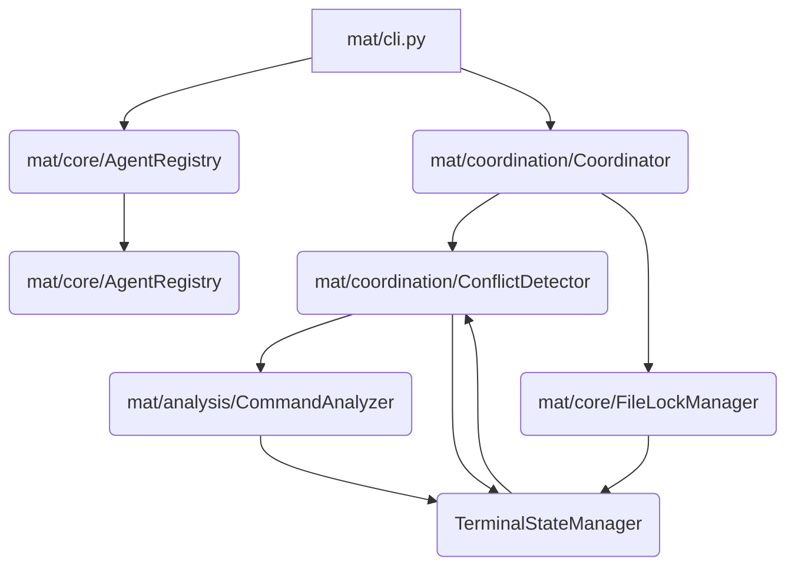

# AgentShell Architecture

AgentShell is designed to be a sophisticated, distributed multi-agent terminal coordination system. Its primary goal is to enable autonomous AI agents to collaborate on executing shell commands within shared computational environments. To achieve robust, conflict-free operation in a distributed setting, AgentShell leverages advanced distributed systems concepts, including Conflict-Free Replicated Data Types (CRDTs) and distributed consensus algorithms. A critical component of this architecture is the **TerminalStateManager**, which utilizes Vector Clocks and Operational Transformation (OT) to ensure that the terminal buffer state remains causally consistent across all participating agents, further utilizing Lamport Timestamps for strict ordering where necessary.

## Module Relationships

The following diagram illustrates the high-level dependencies and interactions between the core modules of the conflict detection system.

## Module Descriptions

| Module Path | Role Description |
| :--- | :--- |
| `mat/cli.py` | **Command Line Interface:** Provides the entry point for users or orchestrators to interact with the AgentShell system, initiating tasks and monitoring agent activity. |
| `mat/core/AgentRegistry.py` | **Agent Registry:** Maintains a centralized (or distributed, depending on deployment) catalog of all active AI agents, tracking their capabilities, current state, and network addresses. |
| `mat/core/FileLockManager.py` | **File Lock Manager:** Implements mechanisms to manage access to shared resources (e.g., configuration files, persistent state) across agents, preventing simultaneous destructive writes. |
| `mat/analysis/CommandAnalyzer.py` | **Command Analyzer:** Responsible for parsing, validating, and semantically analyzing incoming shell commands. It determines the intent and potential side effects of a command before execution. |
| `mat/coordination/ConflictDetector.py` | **Conflict Detector:** The core logic unit that monitors proposed actions from agents. It uses the state provided by the `TerminalStateManager` to predict and detect potential conflicts arising from concurrent command execution. |
| `mat/coordination/Coordinator.py` | **Coordinator:** Acts as the central decision-maker. It receives requests, consults the `ConflictDetector`, manages the execution workflow, and orchestrates the sequence of operations across agents. |
| `mat/core/__init__.py` | **Core Abstractions:** Contains foundational interfaces and base classes for the system components. |
| `mat/coordination/__init__.py` | **Coordination Abstractions:** Defines interfaces for coordination protocols used by the Coordinator and Detector. |
| `mat/analysis/__init__.py` | **Analysis Abstractions:** Defines interfaces for command parsing and semantic analysis. |
| **TerminalStateManager** (Conceptual/Implied) | **State Management:** This critical module maintains the authoritative, causally-consistent view of the terminal buffer. It uses **Vector Clocks** to track causality and **Operational Transformation (OT)** to merge concurrent edits (e.g., keystrokes, output lines) from different agents without losing information or violating ordering. **Lamport Timestamps** are used to establish a total ordering for events that are concurrent but must be serialized for display consistency. |

## Data Flow Explanation

The execution flow in AgentShell follows a request-analyze-coordinate-update pattern:

1. **Initiation:** A command is submitted via `mat/cli.py` to the `Coordinator`.
2. **Analysis:** The `Coordinator` passes the command to `CommandAnalyzer.py`. The Analyzer validates the command and determines its required resources and potential impact.
3. **Pre-Execution Check:** Before execution, the `Coordinator` consults the `ConflictDetector`. The Detector queries the `TerminalStateManager` to understand the current causal history of the terminal state.
4. **Locking:** If the command requires shared resources, the `FileLockManager` is engaged to acquire necessary locks.
5. **Execution & State Update:** The agent executes the command. The resulting output or state change is fed back into the system. This change is processed by the **TerminalStateManager**.
    * The State Manager applies OT to the incoming operation against its current state, ensuring that if another agent concurrently modified the buffer, the changes are merged correctly.
    * Vector Clocks are updated to reflect the new causal dependency.
    * Lamport Timestamps are used to assign a definitive order to the merged operation, ensuring that the terminal display reflects events in a globally agreed-upon sequence.
6. **Conflict Resolution:** If the `ConflictDetector` identifies a conflict (e.g., two agents attempting to write to the same line simultaneously), it signals the `Coordinator`. The Coordinator then uses the state information from the `TerminalStateManager` (which holds the causally-merged history) to decide on a resolution strategy (e.g., prioritizing one agent, or merging the operations based on OT rules).
7. **Feedback:** The final, consistent state is maintained by the `TerminalStateManager`, which is then accessible by all agents and the CLI for display.